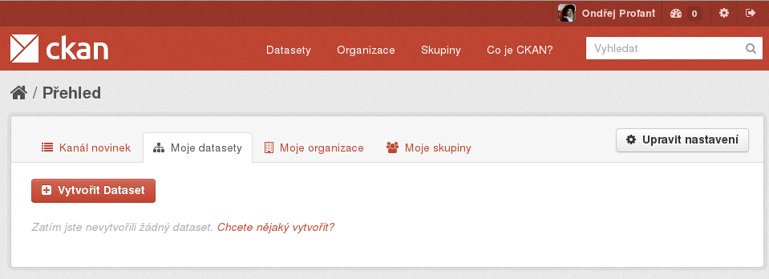

CKAN: základní návod
====================

Co je to CKAN?
--------------

CKAN je v současné době nejrozšířenější open source technologií, užívanou pro zveřejňování otevřených dat. CKAN je ve své podstatě speciální webový portál, kam se data nahrávají. Využívá jej i hlavní město Praha. Má dvě části.

Jeho veřejná část je přístupná na adrese `opendata.praha.eu`. Pro nahrání však potřebujete využít neveřejnou část přístupnou pouze ze sítě mepnet na adrese `private.opendata.praha.eu`

**Portál otevřených dat nabízí tzv. datasety, tedy sady/složky dat. Tyto sady pak tvoří jednotlivé soubory v různých formátech. Jaké a proč je vysvětleno dále.**

Jak zveřejnit data?
-------------------

Cílem Prahy je nabídnout co nejvíce otevřených dat ze všech oblastí. Proto se tento návod zabývá tím, jak data do tohoto portálu přidávat.

Data lze přidávat tak, že je nejprve vytvořen nový dataset (tedy sada/složka dat). To lze uskutečnit následujícím způsobem: 

1. 	Vpravo nahoře je tlačítko „Přihlásit se“ (v anglické verzi „Login“).

	

2. 	Zobrazí se stránka s přihlašovacím dialogem. Zde zadejte své přihlašovací údaje.

	
	
3. 	Po úspěšném přihlášení se vám zobrazí „Kanál novinek“.

	
	
4. 	Nový dataset založíte na panelu (záložce, tabu) vedle „Moje datasety“.

	

5. 	Při vytvoření datasetu musíte zadat nezbytná metadata. Metadata popisují společné znaky daného datasetu.

Dataset je sada/složka, kde se shromažďují dílčí zdroje. Svůj dataset může mít například „Samospráva“, „Školství“, „Majetek“ ₋ ideální je zřídit obdobnou strukturu datasetů jako je tomu v případě odborů. Každý odbor bude tak mít svůj dataset; všichni, kteří v rámci odboru zveřejňují otevřená data pak budou používat pouze jeden svůj konkrétní. Do datasetu se následně přidávají jednotlivé zdroje (soubory). To může být např. konkrétní tabulka („seznam škol“, „seznam nebytových prostor“).

V jakém formátu uveřejnit?
--------------------------

Zdroj může být jednoduchá spreadsheetová (excelovská) tabulka. Nicméně v rámci ni musí být dodržet správný formát, nesmí se používat listy etc. Ideální je tabulku uložit ve formátu „comma separated values“ ₋ CSV (ten vám nežádoucí věci ani nedoloží uložit). Jedná se o základní a nejlépe čitelný formát pro data uspořádaná do tabulek a proto je velmi důsledně podporován v rámci otevřených dat. 

Jak ta data získám?
-------------------

Většina informačních systémů umí exportovat. Lze tedy data těžko dostupná z původní aplikace „vyvézt“ tak, aby byla použita nezávisle na programu, ve kterém byla vytvořena. Např. Gordic Ginis (v samostatném návodu) vám dovolí vyexportovat seznam faktur přímo jako CSV). Dané CSV můžete rovnou nahrát jako součást datasetu na portál otevřených dat. Samozřejmě nejdříve se musíte ujistit, že jste exportovali jen žádaná data (např. neobsahují osobní údaje). Kromě toho lze samozřejmě zveřejňovat i jiné typy souborů, nicméně .csv a .txt jsou v tomto případě preferované typy.

\newpage
